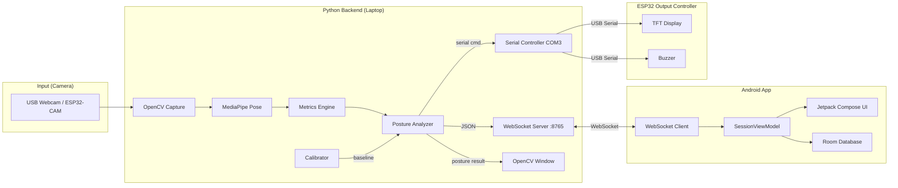
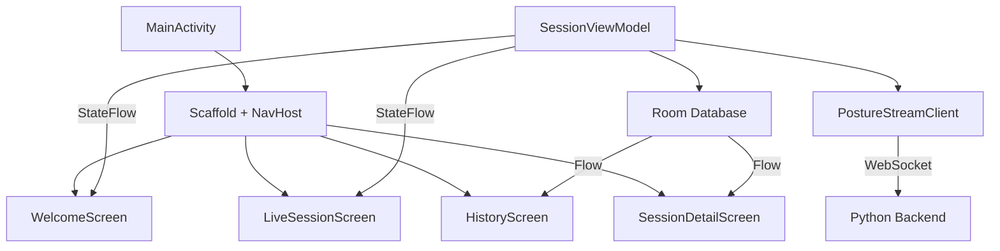

# ASEP2 Project — Full Technical Walkthrough

## Tech Stack (Quick Summary)

| Layer | Technology | Language |
|---|---|---|
| **Backend / Brain** | Python (OpenCV + MediaPipe + WebSockets + PySerial) | Python 3 |
| **Android App** | Kotlin, Jetpack Compose, Room DB, OkHttp WebSocket | Kotlin |
| **Camera Input** | ESP32-CAM (MJPEG over WiFi) *or* USB Webcam | C++ (Arduino) |
| **Output Controller** | ESP32 + TFT Display (TFT_eSPI) + Buzzer (LEDC PWM) | C++ (Arduino) |
| **Communication** | WebSocket (Python ↔ Android), USB Serial (Python ↔ ESP32) | JSON / Plain text |

---

## Architecture Overview



---

## Detailed Component Breakdown

---

### 1. Camera Input Layer

The system supports **two camera options**:

#### Option A: USB Webcam (current default)
- Configured via `config.WEBCAM_INDEX = 0`
- Opened directly with `cv2.VideoCapture(0)`
- Zero latency, simplest setup

#### Option B: ESP32-CAM ([esp32_cam_streamer.ino](file:///c:/Users/a/Documents/ASEP2_Project/esp32_cam_streamer/esp32_cam_streamer.ino))
- AI-Thinker ESP32-CAM board
- Connects to WiFi, starts an HTTP MJPEG stream on port 81 at `/stream`
- Python reads the stream URL: `http://<ESP32-IP>:81/stream`
- Resolution: VGA (640×480) with PSRAM, QVGA (320×240) without
- Uses `multipart/x-mixed-replace` MIME type for continuous JPEG frames

---

### 2. Python Backend (`posture_monitor/`)

This is the **brain** of the entire system. It runs on a laptop and orchestrates everything.

#### 2.1 Entry Point: [main.py](file:///c:/Users/a/Documents/ASEP2_Project/posture_monitor/main.py)

Runs a **state machine** with 4 states:

```
WAITING → CALIBRATING → MONITORING → STOPPED
   ↑______________|          |
   |_________________________|  (user stops)
```

**Main loop flow (per frame):**
1. Check for WebSocket commands from the Android app
2. Read a frame from the webcam (`cap.read()`)
3. Flip the frame horizontally (`cv2.flip(frame, 1)`)
4. Run pose detection → get 7 body landmarks
5. Based on current state:
   - **WAITING**: Show "Ready" overlay, broadcast `IDLE` to app
   - **CALIBRATING**: Collect metric samples, show countdown, broadcast progress
   - **MONITORING**: Analyze posture, draw overlays, send serial commands, broadcast results
6. Draw serial/WebSocket status indicators on frame
7. Display frame in OpenCV window
8. Handle keyboard: `ESC` = quit, `C` = calibrate, `S` = stop monitoring

#### 2.2 Pose Detection: [pose_detector.py](file:///c:/Users/a/Documents/ASEP2_Project/posture_monitor/engine/pose_detector.py)

- Wraps **Google MediaPipe Pose** (`mp.solutions.pose`)
- Confidence thresholds: detection = 0.5, tracking = 0.5
- Extracts **7 key landmarks** from the 33 MediaPipe provides:

| Key | MediaPipe Index | Body Part |
|---|---|---|
| `nose` | 0 | Nose tip |
| `ls` | 11 | Left shoulder |
| `rs` | 12 | Right shoulder |
| `le` | 7 | Left ear |
| `re` | 8 | Right ear |
| `lh` | 23 | Left hip |
| `rh` | 24 | Right hip |

- Landmarks are converted from normalized (0-1) to pixel coordinates: `(int(lm.x * width), int(lm.y * height))`
- Returns `None` if no person is detected

#### 2.3 Metrics Computation: [metrics.py](file:///c:/Users/a/Documents/ASEP2_Project/posture_monitor/engine/metrics.py)

> [!IMPORTANT]
> This is the core math — **5 metrics** define whether your posture is good or bad.

**Metric 1: `forward` (Forward Head Distance)**
```
forward = distance(nose, shoulder_center) / shoulder_width
```
- `shoulder_center` = midpoint of left and right shoulders
- Normalized by shoulder width so it's body-size independent
- **Higher value = head is further forward** (bad)
- Typical good value: ~0.75

**Metric 2: `slope` (Shoulder Slope)**
```
slope = |right_shoulder_y - left_shoulder_y| / (|right_shoulder_x - left_shoulder_x| + ε)
```
- Measures how uneven the shoulders are
- **Higher value = more tilted shoulders** (bad)
- Typical good value: ~0.08

**Metric 3: `tilt` (Head Tilt)**
```
angle = |atan2(right_ear_y - left_ear_y, right_ear_x - left_ear_x)| in degrees
if angle > 90: angle = 180 - angle
```
- Uses ear positions to detect sideways head tilt
- **Higher value = more tilted head** (bad)
- Typical good value: ~5°

**Metric 4: `nose_shoulder` (Nose-to-Shoulder Perpendicular Distance)**
```
line_len = distance(left_shoulder, right_shoulder)
dist = |cross_product(shoulder_line, nose_to_shoulder_vector)| / line_len
nose_shoulder = dist / line_len
```
- Perpendicular distance from nose to the shoulder line, double-normalized
- **Lower value = nose dropping toward shoulder line = slouching** (bad)
- Typical good value: ~0.7

**Metric 5: `torso` (Torso Length Ratio)**
```
shoulder_center = midpoint(left_shoulder, right_shoulder)
hip_center = midpoint(left_hip, right_hip)
torso = distance(shoulder_center, hip_center) / shoulder_width
```
- Normalized torso length
- **Lower value = spine is compressed/curved** (bad)
- Typical good value: ~1.5

#### 2.4 Calibration: [calibrator.py](file:///c:/Users/a/Documents/ASEP2_Project/posture_monitor/calibration/calibrator.py)

Calibration establishes what "good posture" looks like **for this specific user**:

1. User sits with good posture for **5 seconds** (`CALIBRATION_SECONDS`)
2. Every frame, `compute_metrics()` is called and all 5 values are appended to sample lists
3. After 5 seconds, each metric is **averaged**:
   ```python
   baseline = { key: sum(samples) / len(samples) for each metric }
   ```
4. If no person was detected, **default baseline** is used:
   ```python
   {'forward': 0.75, 'slope': 0.08, 'tilt': 5.0, 'nose_shoulder': 0.7, 'torso': 1.5}
   ```

#### 2.5 Posture Analysis: [posture_analyzer.py](file:///c:/Users/a/Documents/ASEP2_Project/posture_monitor/engine/posture_analyzer.py)

**Thresholds are derived from calibration baseline + config multipliers:**

| Metric | Threshold Formula | Direction |
|---|---|---|
| Forward | `baseline × 1.35` | `current > threshold` → bad |
| Slope | `baseline + 0.15` | `current > threshold` → bad |
| Tilt | `baseline + 15°` | `current > threshold` → bad |
| Nose-Shoulder | `baseline × 0.65` | `current < threshold` → bad |
| Torso | `baseline × 0.90` | `current < threshold` → bad |

**Issue detection per frame:**
- Forward exceeds threshold → `"FORWARD HEAD"`
- Slope exceeds threshold → `"UNEVEN SHOULDERS"`
- Tilt exceeds threshold → `"HEAD TILT"`
- Nose-shoulder below threshold → `"SLOUCHING"`
- Torso below threshold → `"SPINE NOT STRAIGHT"`

**State machine (3 posture states):**
```
GOOD → BAD (any issue detected, bad_frames < 30)
BAD  → ALERT (bad_frames > 30 consecutive frames, ~1 second)
BAD  → GOOD (all issues cleared, bad_frames reset to 0)
ALERT → GOOD (all issues cleared)
```

The `ALERT_THRESHOLD = 30` means roughly **30 consecutive bad frames** before escalating from BAD to ALERT.

#### 2.6 Serial Controller: [serial_controller.py](file:///c:/Users/a/Documents/ASEP2_Project/posture_monitor/hardware/serial_controller.py)

- Communicates with ESP32 output controller via **USB Serial at 115200 baud**
- **Rate-limited**: only sends if command changed OR 0.3 seconds elapsed
- Graceful fallback: if pyserial isn't installed or port unavailable, runs in display-only mode
- Protocol (newline-terminated strings):

| Command | Meaning |
|---|---|
| `GOOD\n` | Good posture |
| `BAD:issue1,issue2\n` | Bad posture with issues |
| `ALERT\n` | Persistent bad posture alarm |
| `NONE\n` | No person detected |
| `CAL\n` | Calibration in progress |
| `READY\n` | Monitoring started |
| `OFF\n` | System shutdown |

#### 2.7 WebSocket Server: [ws_server.py](file:///c:/Users/a/Documents/ASEP2_Project/posture_monitor/server/ws_server.py)

- **Async WebSocket server** running in a background thread (separate from OpenCV's main thread)
- Binds to `0.0.0.0:8765` (all network interfaces)
- Uses Python's `websockets` library with `asyncio`
- **Thread-safe bridge**: main thread calls `broadcast()` which schedules coroutines via `asyncio.run_coroutine_threadsafe()`
- **Rate-limited** broadcasts: max 1 update every 0.5 seconds (`WS_BROADCAST_INTERVAL`)
- Incoming commands from the app are placed in a thread-safe `queue.Queue`

**JSON format sent to app:**
```json
{
  "type": "posture_update",
  "state": "GOOD" | "BAD" | "ALERT" | "CALIBRATING" | "IDLE" | "STOPPED" | "NO_PERSON",
  "metrics": {"forward": 0.74, "slope": 0.05, "tilt": 3.2, "nose_shoulder": 0.68, "torso": 1.45},
  "issues": ["FORWARD HEAD", "SLOUCHING"],
  "calibration_progress": 0.0 - 1.0,
  "timestamp": 1717600000000
}
```

**JSON format received from app:**
```json
{"command": "START_CALIBRATION" | "START_MONITORING" | "STOP_MONITORING" | "STOP"}
```

---

### 3. ESP32 Output Controller ([esp32_output_controller.ino](file:///c:/Users/a/Documents/ASEP2_Project/esp32_output_controller/esp32_output_controller.ino))

A **separate ESP32 board** (not the camera one) that provides physical feedback.

#### 3.1 Hardware

| Component | Pin | Purpose |
|---|---|---|
| TFT Display (SPI) | CS=GPIO5, RST=GPIO16, DC=GPIO17, MOSI=GPIO23, SCLK=GPIO18 | Visual feedback |
| Buzzer | GPIO 4 | Audio feedback |

- Uses **TFT_eSPI** library for display control
- Uses **LEDC PWM** for buzzer tones (ESP32 doesn't have Arduino's `tone()`)
- Powered via the same USB cable used for serial communication

#### 3.2 TFT Display Screens

Each posture state shows a **colorful emoji face** with status text:

| State | Background | Face | Emoji |
|---|---|---|---|
| **GOOD** | Deep green `0x0320` | Bright green circle | 😊 Happy face with pink blush cheeks |
| **BAD** | Dark amber `0x4200` | Yellow circle | 😟 Worried face with angled eyebrows + frown |
| **ALERT** | Full red | Dark maroon circle with yellow ring | ✖️✖️ X-eyes + thick sad frown |
| **NO PERSON** | Dark gray | Gray circle | ❓ Large question mark |
| **CALIBRATING** | Dark blue | Blue circle with cyan rings | 🧍 Person icon silhouette |
| **READY** | Green | Text only | ✅ "READY! Monitoring your posture..." |
| **OFF** | Black | Text only | "System OFF" in dark gray |

Screen dimensions are auto-detected at runtime. The face is centered with `FACE_RADIUS = min(width, height) / 4`.

#### 3.3 Buzzer Patterns

| Mode | Frequency | Pattern |
|---|---|---|
| **OFF** | — | Silent |
| **BEEP** (bad posture) | 2000 Hz | 150ms on / 350ms off (intermittent) |
| **ALARM** (persistent bad) | 3000 Hz | 100ms on / 100ms off (rapid) |
| **READY** confirmation | 1500→2000 Hz | Two quick ascending tones |

Buzzer is handled **non-blocking** using `millis()` timing in the main loop.

#### 3.4 Optimization

- **Avoids unnecessary redraws**: Screen only updates when the status actually changes (`lastStatus != newStatus`)
- Command parsing is character-by-character until `\n` or `\r` is received

---

### 4. Android App (`app_posture_bot/`)

A **Jetpack Compose** Android application that serves as a wireless remote control and monitoring dashboard.

#### 4.1 Architecture



#### 4.2 Screens

| Screen | Purpose |
|---|---|
| **WelcomeScreen** | Enter server IP/URL, tap "Start Calibration" |
| **LiveSessionScreen** | Real-time posture status, metrics, body-part percentages, state history timeline |
| **HistoryScreen** | List of past sessions with good% and alert counts |
| **SessionDetailScreen** | Detailed view of a single session's data |

Navigation uses **Jetpack Navigation Compose** with a bottom bar (Live / History tabs).

#### 4.3 WebSocket Client ([PostureStreamClient.kt](file:///c:/Users/a/Documents/ASEP2_Project/app_posture_bot/app/src/main/java/com/posturebot/app/network/websocket/PostureStreamClient.kt))

- Connects to `ws://<laptop-IP>:8765`
- Receives JSON `posture_update` messages
- Can send commands: `START_CALIBRATION`, `START_MONITORING`, `STOP_MONITORING`, `STOP`
- Exposes `postureUpdateFlow` (Kotlin Flow) and `connectionState` (Connected / Disconnected / Reconnecting)
- Manual reconnect support (no auto-reconnect to prevent conflicts)

#### 4.4 SessionViewModel ([SessionViewModel.kt](file:///c:/Users/a/Documents/ASEP2_Project/app_posture_bot/app/src/main/java/com/posturebot/app/viewmodel/SessionViewModel.kt))

The **central orchestrator** on the Android side:

**State management:**
- Maps backend string states to `PostureState` enum: `Idle`, `Calibrating`, `Good`, `Warning`, `Bad`, `Stopped`
- Protects against premature state transitions (keeps `Calibrating` state even if backend briefly sends `IDLE`)

**Body-part percentage tracking (Android-side computation):**
- For each monitored frame, checks which issues are present
- Tracks per-body-part bad frame counts
- Computes: `good% = (totalFrames - badFrames) / totalFrames × 100`
- Maps: `FORWARD HEAD` → "Head Forward", `UNEVEN SHOULDERS` → "Shoulders", `HEAD TILT` → "Head Tilt", `SLOUCHING` → "Neck", `SPINE NOT STRAIGHT` → "Spine"

**Haptic feedback:**
- **Good**: No vibration
- **Warning**: 200ms single vibration at 50% intensity
- **Bad**: Triple pulse pattern (100ms on, 100ms off, 100ms on)

**Session persistence (Room DB):**
- Creates a `Session` record with UUID on start
- Writes `PostureSample` records every **1 second** (periodic write job)
- On session end, computes `goodPercent` and `totalAlerts` from stored samples
- Schema: `sessions` table + `posture_samples` table (linked by `sessionId`)

---

### 5. Complete Data Flow (End-to-End)

Here's what happens every single frame when the system is in **MONITORING** state:

```
1. USB Webcam → frame (BGR numpy array)
         ↓
2. cv2.flip(frame, 1)  → mirror horizontally
         ↓
3. PoseDetector.detect(frame)
   → cv2.cvtColor(BGR→RGB) → MediaPipe Pose → 33 landmarks
   → Extract 7 key points (nose, shoulders, ears, hips)
         ↓
4. compute_metrics(pts)
   → Calculate 5 numbers: forward, slope, tilt, nose_shoulder, torso
         ↓
5. PostureAnalyzer.analyze(metrics)
   → Compare each metric against calibrated thresholds
   → Determine issues: ["FORWARD HEAD", "SLOUCHING", ...]
   → Update bad_frames counter
   → Return PostureResult(state, issues, metrics)
         ↓ (3 parallel outputs)
   ┌──────────┬──────────────┬──────────────────┐
   │          │              │                  │
   ↓          ↓              ↓                  ↓
6a. OpenCV   6b. Serial    6c. WebSocket      6d. On-screen
    Window       → ESP32       → Android          metrics
    (laptop      (COM3)        app                overlay
     display)
                  ↓              ↓
             7a. TFT LCD    7b. ViewModel
                 draws           parses JSON
                 emoji           updates UI
                 face            writes to Room DB
                  ↓              triggers vibration
             7b. Buzzer
                 beeps/alarms
```

---

### 6. Legacy Files

| File | Description |
|---|---|
| [esp32_posture.py](file:///c:/Users/a/Documents/ASEP2_Project/esp32_posture.py) | Original monolithic script (all-in-one). No WebSocket, no app support. Direct serial + OpenCV only. |
| [pose2.py](file:///c:/Users/a/Documents/ASEP2_Project/pose2.py) | Earlier pose detection experiment |
| [pose_pipeline.py](file:///c:/Users/a/Documents/ASEP2_Project/pose_pipeline.py) | Intermediate pipeline version |

The `posture_monitor/` package is the **current, modular** version that replaced these.
